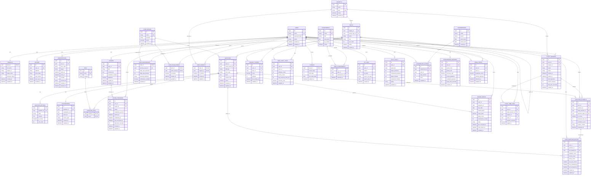

# Diagrama ER - Portuguesando

Este documento descreve o diagrama entidade-relacionamento (ER) do backend.

```mermaid
erDiagram
    USERS {
      uuid id PK
      string email UK
      string password_hash
      string status
      datetime created_at
      datetime updated_at
    }

    PROFILES {
      uuid user_id PK,FK
      string full_name
      string avatar_url
      string target_exam
      int timezone_offset
      datetime created_at
      datetime updated_at
    }

    DEVICES {
      uuid id PK
      uuid user_id FK
      string platform
      string push_token
      string app_version
      datetime last_seen_at
      datetime created_at
    }

    SUBSCRIPTIONS {
      uuid id PK
      uuid user_id FK
      string plan_code
      string status
      datetime starts_at
      datetime ends_at
      string provider
      string external_id
      datetime created_at
      datetime updated_at
    }

    EXAM_BOARDS {
      uuid id PK
      string name UK
      string acronym
      boolean active
      datetime created_at
    }

    SUBJECTS {
      uuid id PK
      string name
      string slug UK
      boolean active
      datetime created_at
    }

    TOPICS {
      uuid id PK
      uuid subject_id FK
      uuid parent_topic_id FK
      string name
      string slug
      int sort_order
      boolean active
      datetime created_at
    }

    LESSONS {
      uuid id PK
      uuid topic_id FK
      string title
      text content_md
      int estimated_minutes
      boolean published
      datetime created_at
      datetime updated_at
    }

    QUESTIONS {
      uuid id PK
      uuid topic_id FK
      uuid exam_board_id FK
      string difficulty
      string stem_type
      text stem
      text support_text
      boolean active
      datetime created_at
      datetime updated_at
    }

    QUESTION_OPTIONS {
      uuid id PK
      uuid question_id FK
      string label
      text content
      boolean is_correct
      int sort_order
    }

    EXPLANATIONS {
      uuid id PK
      uuid question_id FK
      text explanation_md
      text quick_tip
      string source_type
      datetime created_at
      datetime updated_at
    }

    TAGS {
      uuid id PK
      string name UK
      string category
    }

    QUESTION_TAGS {
      uuid question_id PK,FK
      uuid tag_id PK,FK
    }

    USER_PREFERENCES {
      uuid user_id PK,FK
      uuid primary_board_id FK
      int daily_goal_questions
      int daily_goal_minutes
      string preferred_difficulty
      boolean notifications_enabled
      datetime updated_at
    }

    USER_EXAM_BOARDS {
      uuid user_id PK,FK
      uuid exam_board_id PK,FK
      boolean is_primary
      datetime created_at
      datetime updated_at
    }

    USER_SUBJECTS {
      uuid user_id PK,FK
      uuid subject_id PK,FK
      boolean is_primary
      datetime created_at
      datetime updated_at
    }

    LESSON_PROGRESS {
      uuid id PK
      uuid user_id FK
      uuid lesson_id FK
      string status
      int completion_percent
      datetime started_at
      datetime completed_at
      datetime last_accessed_at
      int total_time_seconds
      datetime created_at
      datetime updated_at
    }

    USER_QUESTION_HISTORY {
      uuid id PK
      uuid user_id FK
      uuid question_id FK
      uuid last_attempt_id FK
      int attempts_count
      int correct_count
      int wrong_count
      boolean last_was_correct
      datetime first_answered_at
      datetime last_answered_at
      datetime created_at
      datetime updated_at
    }

    STUDY_SESSIONS {
      uuid id PK
      uuid user_id FK
      uuid subject_id FK
      string mode
      string status
      datetime started_at
      datetime ended_at
      int total_questions
      int correct_answers
      int total_time_seconds
      datetime created_at
    }

    QUESTION_ATTEMPTS {
      uuid id PK
      uuid user_id FK
      uuid question_id FK
      uuid study_session_id FK
      uuid selected_option_id FK
      boolean is_correct
      int response_time_ms
      int confidence_level
      string answer_context
      datetime answered_at
    }

    REVIEW_QUEUE {
      uuid id PK
      uuid user_id FK
      uuid question_id FK
      date due_date
      int interval_days
      decimal ease_factor
      int lapse_count
      int consecutive_correct
      string state
      datetime last_reviewed_at
      datetime next_review_at
      datetime updated_at
    }

    MEMORY_SCORES {
      uuid id PK
      uuid user_id FK
      uuid topic_id FK
      decimal score
      int samples
      datetime last_activity_at
      datetime updated_at
    }

    USER_TOPIC_STATS {
      uuid id PK
      uuid user_id FK
      uuid topic_id FK
      int attempts_count
      int correct_count
      int avg_response_time_ms
      decimal accuracy_rate
      datetime updated_at
    }

    STREAKS {
      uuid user_id PK,FK
      int current_days
      int best_days
      date last_study_date
      datetime updated_at
    }

    ACHIEVEMENTS {
      uuid id PK
      string code UK
      string title
      text description
      int xp_reward
      boolean active
    }

    USER_ACHIEVEMENTS {
      uuid id PK
      uuid user_id FK
      uuid achievement_id FK
      datetime unlocked_at
    }

    XP_LOGS {
      uuid id PK
      uuid user_id FK
      string source
      int xp_delta
      string source_ref_type
      uuid source_ref_id
      datetime created_at
    }

    DAILY_GOALS {
      uuid id PK
      uuid user_id FK
      date goal_date
      int target_questions
      int completed_questions
      int target_minutes
      int completed_minutes
      string status
      datetime updated_at
    }

    LEADERBOARDS {
      uuid id PK
      string scope
      string period
      date period_start
      date period_end
      datetime created_at
    }

    LEADERBOARD_ENTRIES {
      uuid id PK
      uuid leaderboard_id FK
      uuid user_id FK
      int rank_position
      int score
      datetime updated_at
    }

    PERFORMANCE_REPORTS {
      uuid id PK
      uuid user_id FK
      date period_start
      date period_end
      decimal accuracy_rate
      int solved_questions
      int reviewed_questions
      int study_time_seconds
      datetime created_at
    }

    WEAK_TOPICS {
      uuid id PK
      uuid user_id FK
      uuid topic_id FK
      decimal weakness_score
      int window_attempts
      datetime detected_at
      datetime updated_at
    }

    STUDY_TIME_LOGS {
      uuid id PK
      uuid user_id FK
      uuid study_session_id FK
      uuid subject_id FK
      uuid topic_id FK
      int duration_seconds
      datetime logged_at
    }

    USERS ||--|| PROFILES : has
    USERS ||--o{ DEVICES : uses
    USERS ||--o{ SUBSCRIPTIONS : has
    USERS ||--|| USER_PREFERENCES : configures
    EXAM_BOARDS ||--o{ USER_PREFERENCES : preferred_by
    USERS ||--o{ USER_EXAM_BOARDS : prefers
    EXAM_BOARDS ||--o{ USER_EXAM_BOARDS : selected_in

    USERS ||--o{ USER_SUBJECTS : prefers
    SUBJECTS ||--o{ USER_SUBJECTS : selected_in
    SUBJECTS ||--o{ TOPICS : contains
    TOPICS ||--o{ TOPICS : parent_of
    TOPICS ||--o{ LESSONS : has
    USERS ||--o{ LESSON_PROGRESS : tracks
    LESSONS ||--o{ LESSON_PROGRESS : progress_of

    TOPICS ||--o{ QUESTIONS : has
    EXAM_BOARDS ||--o{ QUESTIONS : from
    QUESTIONS ||--o{ QUESTION_OPTIONS : has
    QUESTIONS ||--|| EXPLANATIONS : has
    QUESTIONS ||--o{ QUESTION_TAGS : tagged
    TAGS ||--o{ QUESTION_TAGS : links

    USERS ||--o{ STUDY_SESSIONS : runs
    SUBJECTS ||--o{ STUDY_SESSIONS : scoped
    STUDY_SESSIONS ||--o{ QUESTION_ATTEMPTS : contains
    USERS ||--o{ QUESTION_ATTEMPTS : makes
    QUESTIONS ||--o{ QUESTION_ATTEMPTS : answered
    QUESTION_ATTEMPTS ||--o{ USER_QUESTION_HISTORY : summarizes

    USERS ||--o{ USER_QUESTION_HISTORY : has
    QUESTIONS ||--o{ USER_QUESTION_HISTORY : history_of

    USERS ||--o{ REVIEW_QUEUE : owns
    QUESTIONS ||--o{ REVIEW_QUEUE : queued
    USERS ||--o{ MEMORY_SCORES : has
    TOPICS ||--o{ MEMORY_SCORES : scored
    USERS ||--o{ USER_TOPIC_STATS : has
    TOPICS ||--o{ USER_TOPIC_STATS : tracked

    USERS ||--|| STREAKS : keeps
    USERS ||--o{ USER_ACHIEVEMENTS : unlocks
    ACHIEVEMENTS ||--o{ USER_ACHIEVEMENTS : awarded
    USERS ||--o{ XP_LOGS : earns
    USERS ||--o{ DAILY_GOALS : sets

    LEADERBOARDS ||--o{ LEADERBOARD_ENTRIES : contains
    USERS ||--o{ LEADERBOARD_ENTRIES : appears

    USERS ||--o{ PERFORMANCE_REPORTS : has
    USERS ||--o{ WEAK_TOPICS : has
    TOPICS ||--o{ WEAK_TOPICS : appears
    USERS ||--o{ STUDY_TIME_LOGS : logs
    STUDY_SESSIONS ||--o{ STUDY_TIME_LOGS : contributes
```
